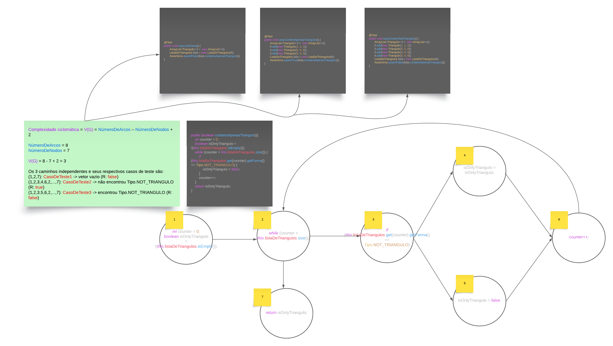

# EngenhariaDeSoftware

### _Repositório para a disciplina de Engenharia de Software I_

### Observações 🚩

* Integrantes: Leonardo Marotta e Mauricio Mucci 🤝
* A pasta _"docs"_ possui um PDF e um PNG com o grafo de fluxo, o cálculo da complexidade ciclomática, a definição dos caminhos independetes e os casos de testes derivados

### Objetivos 🎯

* Trabalho Final: O código escolhido deve envolver laços  (while ou do/while) e/ou if aninhados para permitir melhor demonstração da técnica.
  * Mostre o grafo de controle,
  * O cálculo da complexidade ciclomática e
  * Defina os caminhos independentes a partir do grafo
  * E defina os casos de teste derivados (1 para cada caminho) , com regras genérica para definição dos dados de teste (entradas) e saída esperada

### Grafo de Fluxo 🌊

### Rodando a classe de teste ▶️

* Nosso projeto possui 3 classes:
  1. Triangulo.java
  2. Tipo.java
  3. ListaDeTriangulos.java

* A classe de teste é denominada:
  * ListaDeTriangulosTest.java

* Os 3 casos de teste se encontram na classe supramencionada. Logo, é necessário apenas rodar a mesma.

### Tecnologias Utilizadas 💻

| Java | JUnit  |
|------|--------|
| 17   | 5.10.0 |
